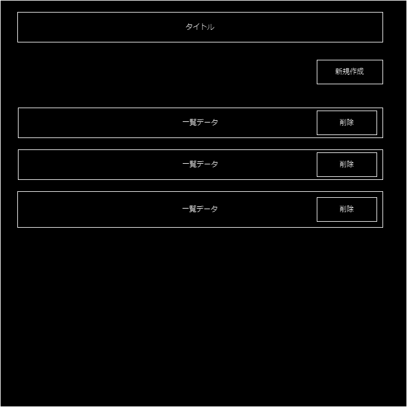
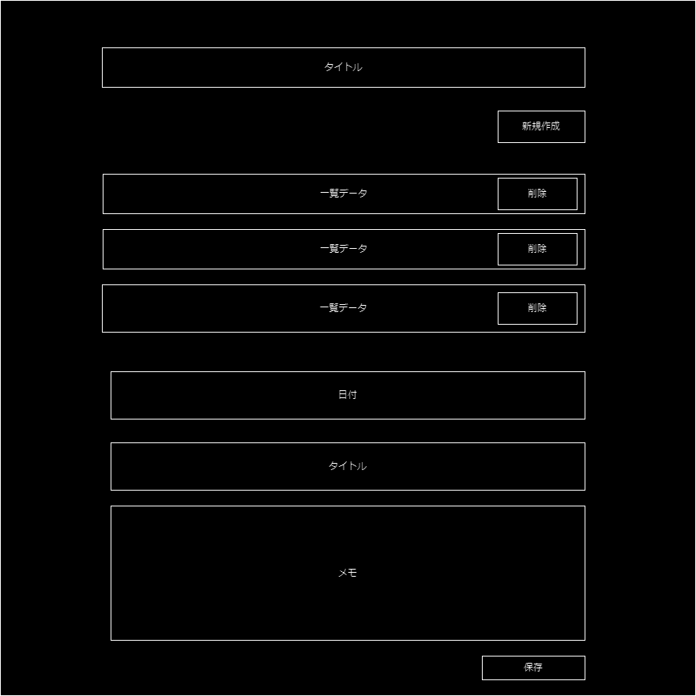

# ウェブアプリの概要

ユーザーがメモを日記のように保存できるアプリ。過去に保存したメモを見たり編集を行うことができる。

# ユーザーストーリー

ユーザーは新規にメモを作成するか、過去のメモを編集するかを選択できる。
日付、タイトル、メモを記載し、保存ボタンを押すと、保存される。

# 機能要件

- ~~ログイン機能(実装したい)~~
- メモ新規作成機能
  - あああああ
- メモ編集機能
- メモ削除機能
- メモ保存機能

# 画面

- 一覧画面

  

- 初期表示時

  - ストレージから一覧を読み込む。
  - 読み込んだデータを表示する。
    - データがない場合は「データがありませんを表示する」

- 新規作成ボタン
  - ボタン押下時にフォームを表示

- 保存ボタン
  - 日付、タイトル、メモをステイトに保存
    - もし 日付 or　タイトルがなければエラーを出す (ex:日付orタイトルが入っていません。)
